# Reflection: Building CampusConnect with GitHub Copilot

**Author:** Sneha Paudel
**Live app:** https://paudelsneha17.github.io/lost-and-found-copilot/

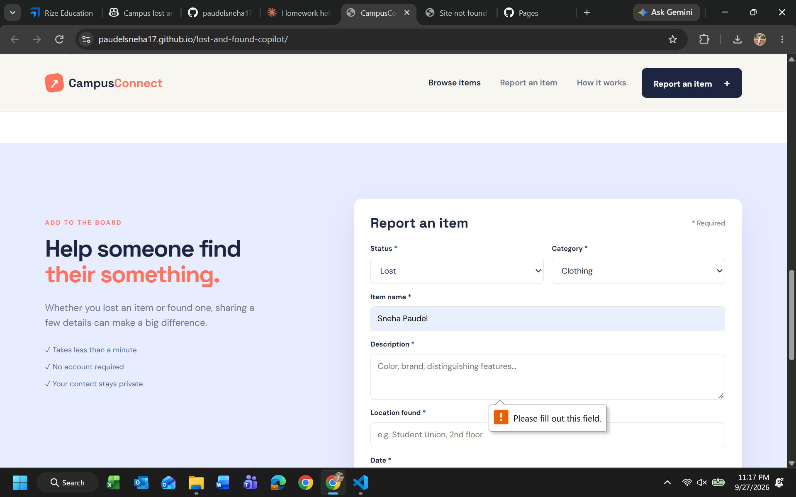

## 1. What did you ask Copilot to help you build? How did you break down the problem?

I used GitHub Copilot to build CampusConnect, a campus lost and found web app using HTML, CSS, and JavaScript. Instead of asking for the whole app at once, I broke it into features and gave Copilot one prompt per feature: first the basic page structure (header, report form, and item display area), then the form fields and item cards, then saving items with localStorage, then search and filters, then "Mark as Claimed" and Delete buttons, and finally styling with Loras College colors. After each prompt, I tested the live site before moving to the next feature.

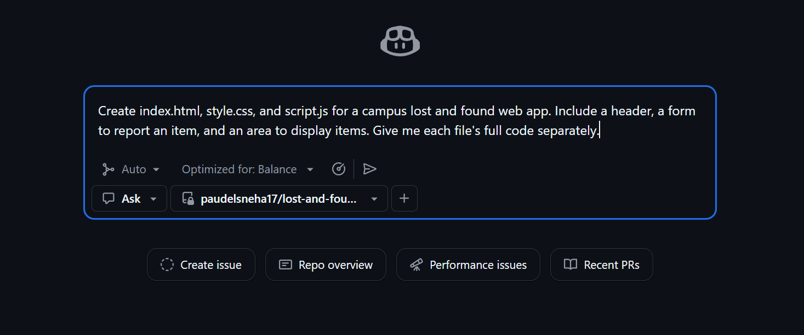
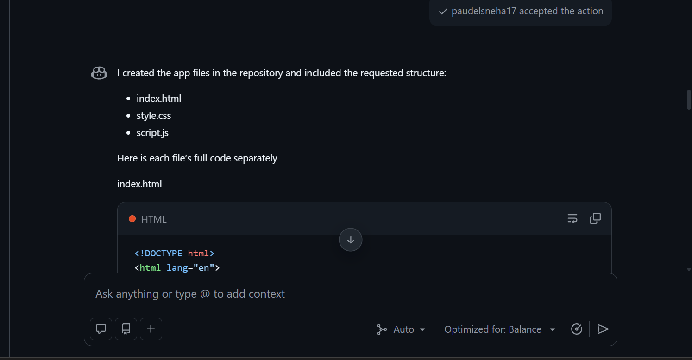
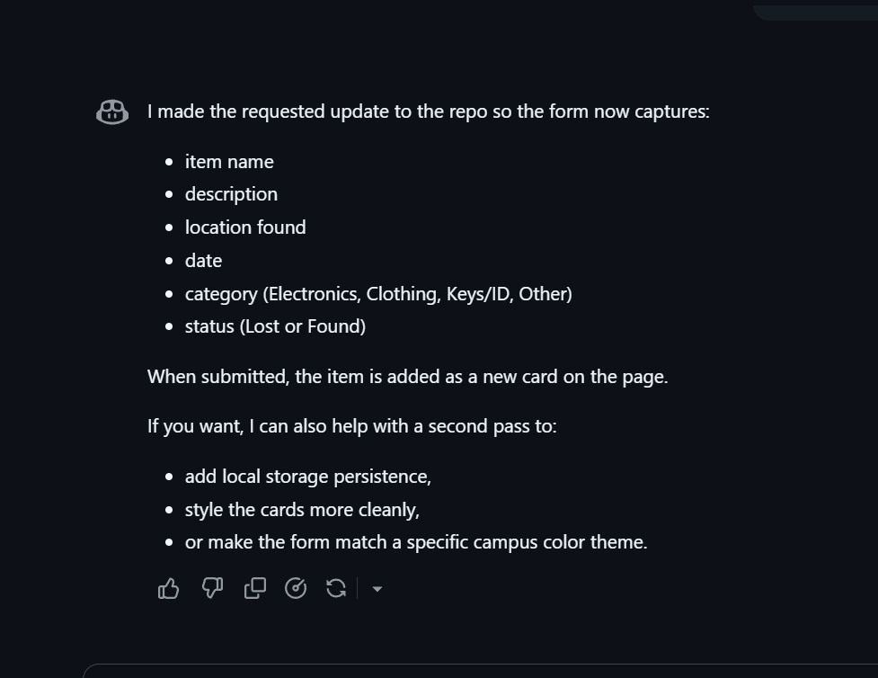

## 2. How did your approach to asking questions change as you worked?

At the start, my prompts only described what I wanted the app to do. Partway through, I noticed Copilot was inconsistent: sometimes it edited my repo files directly, and other times it only showed code snippets without changing anything. When that happened with the Mark as Claimed feature, I had to follow up and ask for the complete file instead of snippets. After that, I started ending my prompts with "Apply the changes directly to the repo," and my requests got more specific, for example naming the exact file (style.css) and listing exactly what I wanted (colors, hover effects, mobile layout).

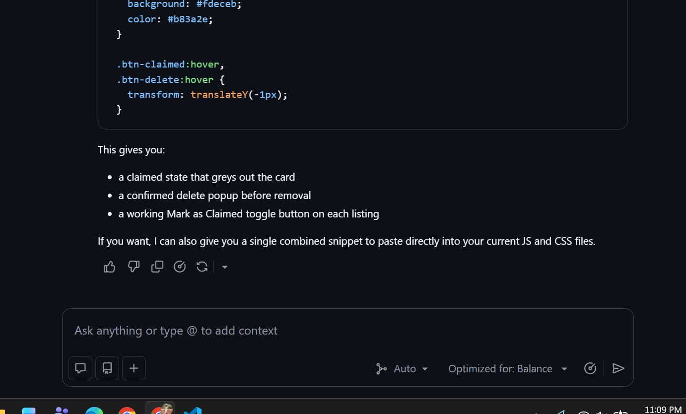
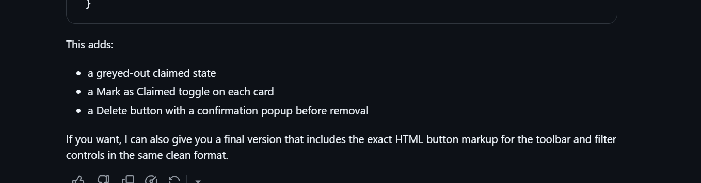
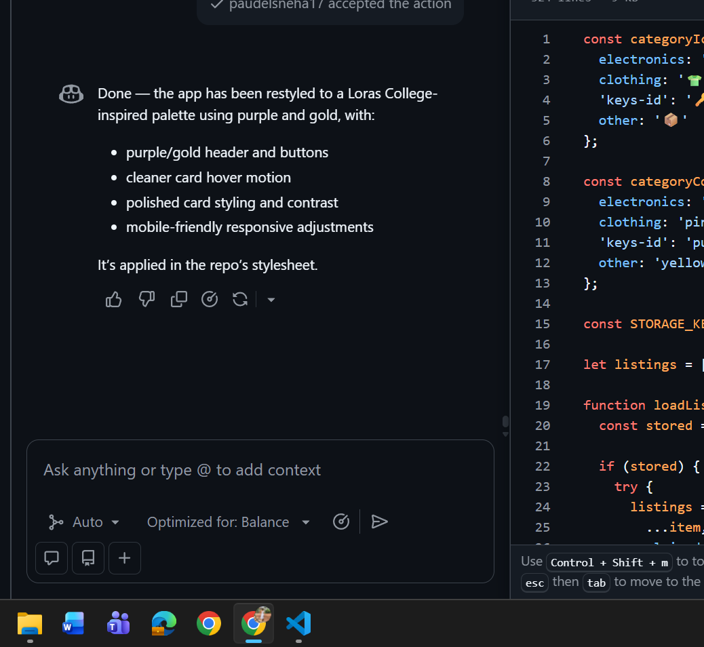

## 3. What parts of the development process with GitHub Copilot surprised you?

The biggest surprise was that Copilot built features before I asked for them. When I asked for a search bar and category filter, Copilot told me they were already implemented, and it had even added a status filter I never requested. It also suggested next steps on its own, like adding localStorage and a campus color theme. I was also surprised that Copilot on GitHub could commit changes straight to my repository, so I barely had to copy and paste code.

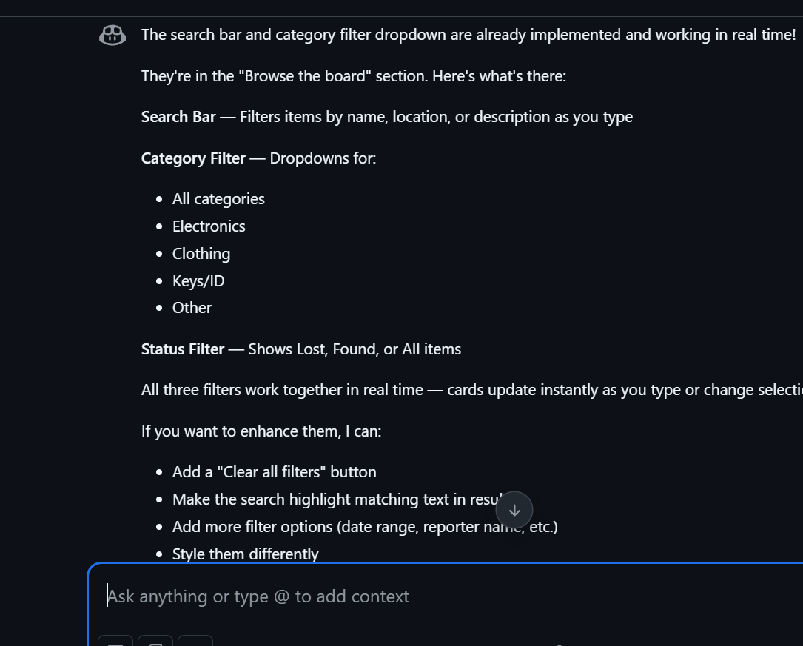

## 4. What did you learn about the technology you used that you didn't know before?

I learned how to publish a website for free using GitHub Pages by deploying from the main branch, and that it takes a minute or two to update after each commit. I also learned how localStorage lets a web app save data in the browser so items stay after refreshing, even without a database or server. I also saw how HTML forms can require fields, which is why the app showed "Please fill out this field" when I left the description empty.

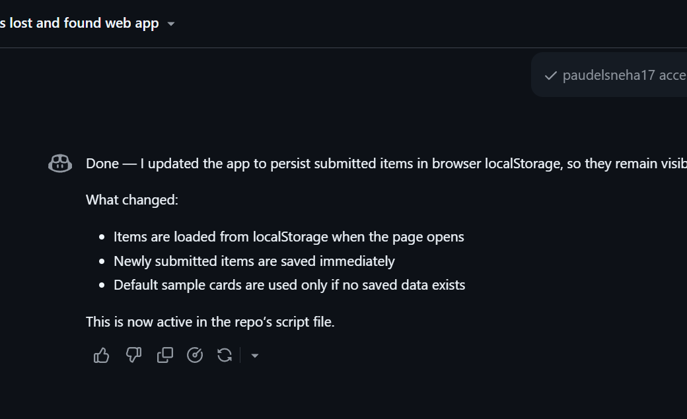
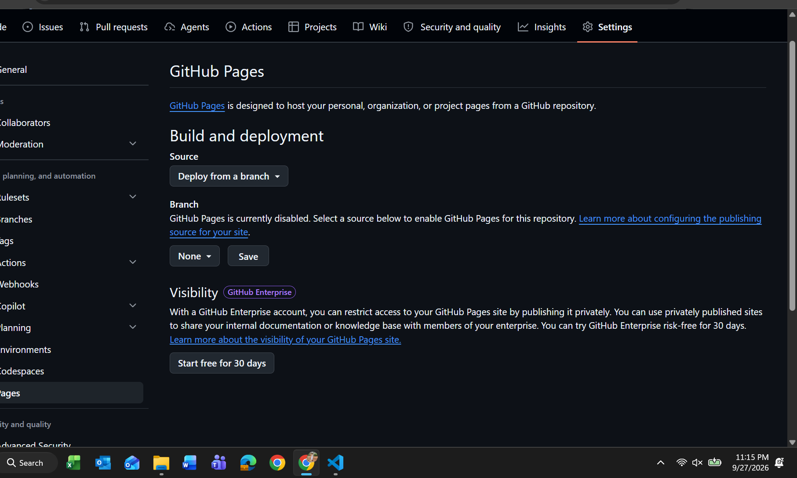
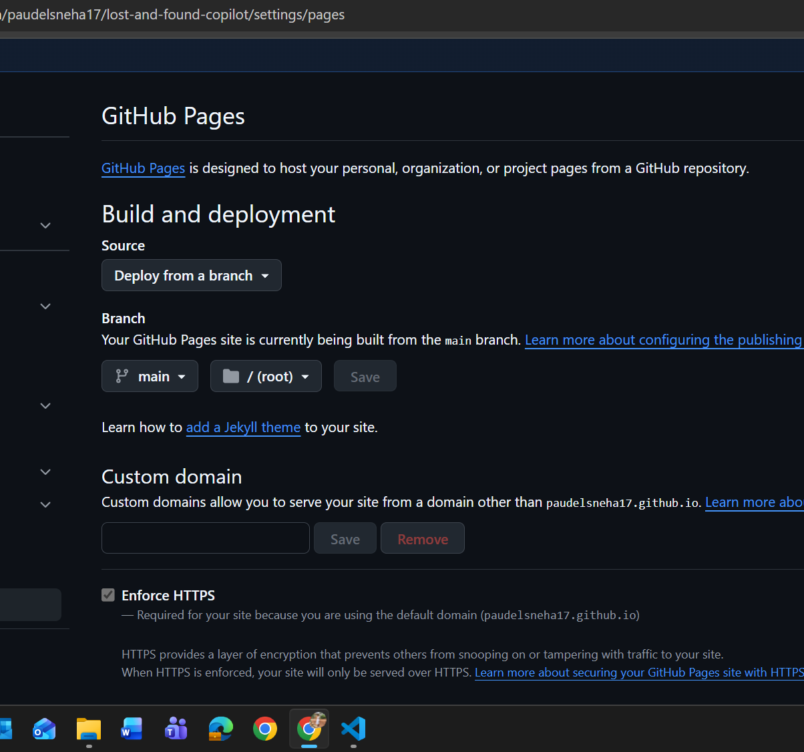

## 5. What would you do differently if you had to build this again?

I would plan all my features at the beginning and tell Copilot to apply changes directly to the repo from the very first prompt, so I wouldn't have to ask twice. I would also set up GitHub Pages right away so I could test each change immediately instead of setting it up partway through. Finally, I would review the code Copilot wrote more carefully so I fully understand how each feature works, not just that it works.
